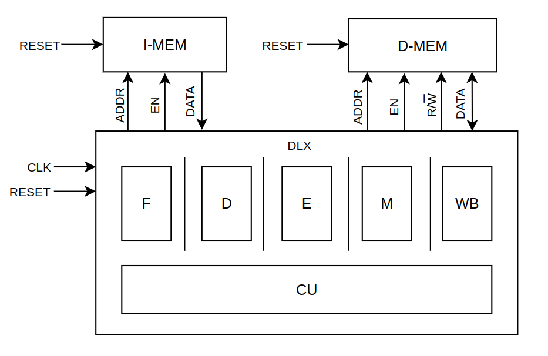
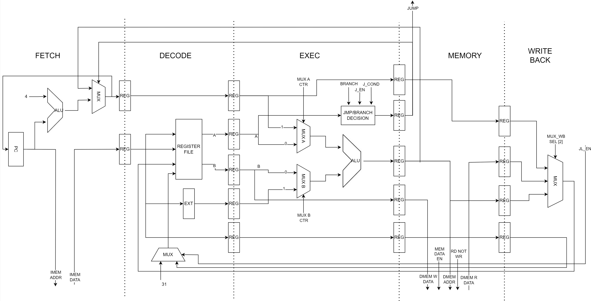
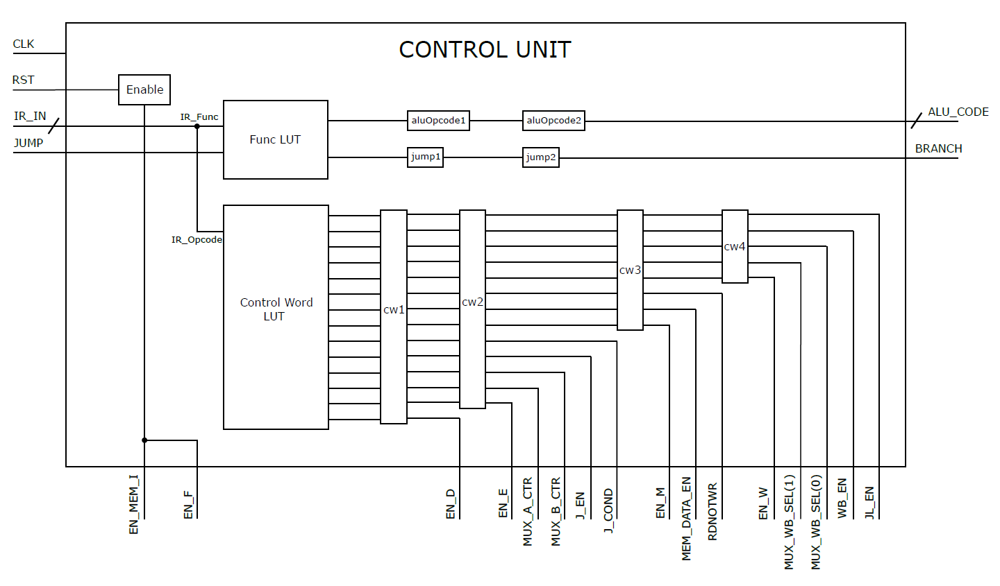

# DLX-Microprocessor

The DLX Microprocessor project focused on the design and implementation of a pipelined CPU  based on the DLX architecture. The project was structured into the following steps:
1. Architectural design and implementation
2. Simulation using **Questa Sim**
3. Synthesis using **Synopsys Design Compiler**

## Architecture

### Datapath

The datapath implements a classic **5-stage RISC pipeline**

#### Instructions implemented
- **R-type**: `ADD`, `ADDU`, `SUB`, `SUBU`, `SLL`, `SRL`, `AND`, `OR`, `XOR`, `SEQ`, `SLT`, `SGT`, `SNE`, `SLE`, `SGE`, `MUL`, `MULTU`

- **I-type**: `JR`, `JALR`, `BEQZ`, `BNEZ`, `ADDI`, `SUBI`, `ANDI`, `ORI`, `XORI`, `SLLI`, `SRLI`, `SEQI`, `SLTI`, `SGTI`, `SUBUI`, `ADDUI`, `SNEI`, `SLEI`, `SGEI`, `LW`, `SW`, `NOP`
  
- **J-type**: `J`, `JAL`

#### ALU optimization
- `ADD`, `ADDU`, `SUB`, `SUBU` are optimized using a **P4 adder** architecture.
- `MUL`, `MULTU` are optimized using a **Booth multiplier** architecture.

### Control unit
The control unit is implemented as a **hardwire control unit**

## Authors
- **[Luca Bozza](https://github.com/luca0b11)**
- **[Giuseppe Webber](https://github.com/giuseppewebber)**
